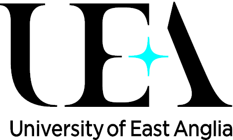
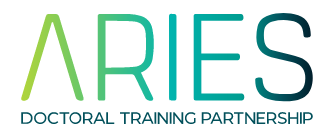
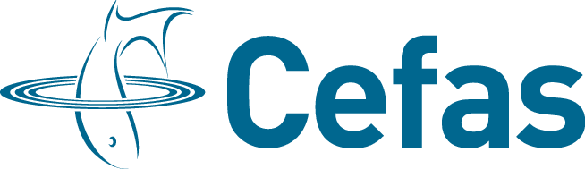

# Introduction to Python in Environmental Sciences
Delivered by [*ARIES Doctoral Training Programme*](https://www.aries-dtp.ac.uk) & the [*Centre for Environment, Fisheries and Acquaculture Studies*](http://www.cefas.co.uk/)

## General information

* The 3-day course organised by [ARIES DTP](https://www.aries-dtp.ac.uk/) and [Cefas](https://www.cefas.co.uk/) giving a hands-on introduction to [Python](http://www.python.org/) programming language.
* You will learn Python programming, starting from the basics, and evolving into data analysis and visualisation using data formats commonly used in environmental sciences. If you have no programming experience in any language, it is recommended that  you take a 1-2 hour online course, such as [Python Basics on datacamp](https://app.datacamp.com/learn/courses/intro-to-python-for-data-science), to get confortable with basic concepts such as variables. 
* Suitable for both python novices and intermediate users.
* In person course at the UEA ([ZICER Building](https://www.uea.ac.uk/about/campus-map), room 2.01). Lunch and refreshments will be provided.
* The course will be in person only, and held at the University of East anglia. Unfortunately we are no longer able to offer the course online simultaneously.

### When and where

| Day | Time (BST) | Topics covered |
|-----|------------|----------------|
| 8th of June 2026 | 8:30 - 17:00 | Python basics |
| 9th of June 2026 | 9:00 - 17:00 | Functions, simple programs and arrays |
| 10th of June 2026 | 9:00 - 17:00 | Plotting and data analysis |

[comment]: <> (Full timetable available [here](programme.md).)

### Topics covered by the course
* Python basics and programming environment
* Core scientific libraries: numpy, scipy, pandas
* Simple visualisation in matplotlib
* Plotting data on maps
* Working with environmental sciences data formats

### Ahead of the course 

* If you have no programming experience in any language, it is recommended that you take a 1-2 hour online course beforehand to get yourself familiarised with basic concepts such as variables. e.g. [Python Basics on datacamp](https://app.datacamp.com/learn/courses/intro-to-python-for-data-science).
* [Install](installation.md) course environment and materials in the week before.
* Bring your own laptop.

## Registration and enquiries

The course is free for 

* Aries DTP students
* Cefas staff and CASE students

The course is open to all UEA staff and students interested in environmental sciences for a fee of 50 GBP. See contact below for enquiries.

[Registeration on Eventbrite](https://www.eventbrite.com/e/1285794900159?aff=oddtdtcreator).

If you have queries please contact:

* [Claire (Cefas)](mailto:claire.beraud@cefas.gov.uk)
* [Alice (UEA, Aries)](mailto:a.hsu@uea.ac.uk)

## Support after the course? 

### Cefas
The PyFAS group meets regularly, to present work, discuss python problems and provide general support. 

Contact Claire Beraud to join the group and receive future invites.

The Turn up & Code code group meets regularly to support personal development in programming in any language.

Contact Lianne Harrison if you want to receive calendar invites.

### UEA
The UEA Python group meets occasionally. Check the archives of previous sessions here: [https://ueapy.github.io](https://ueapy.github.io/). Or join our [Slack workspace](https://uea-python.slack.com/) to ask questions and take part in weekly coding drop ins.

